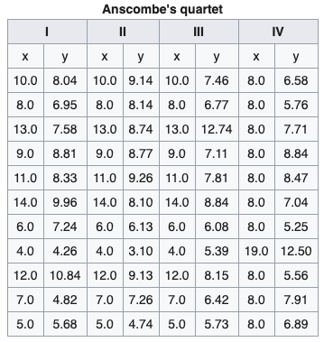

# Anscombe-ZCWD
The Anscombe Peculiarities

Anscombe's quartet comprises four data sets that have nearly identical simple descriptive statistics, 
yet have very different distributions and appear very different when graphed. 
Each dataset consists of eleven (x,y) points. They were constructed in 1973 by the statistician 
Francis Anscombe to demonstrate both the importance of graphing data before analyzing it 
and the effect of outliers and other influential observations on statistical properties. 
He described the article as being intended to counter the impression 
among statisticians that "numerical calculations are exact, but graphs are rough."

